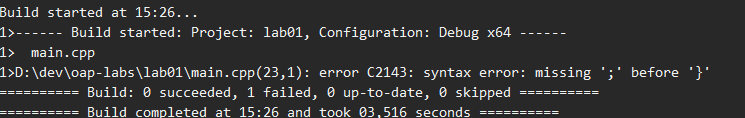
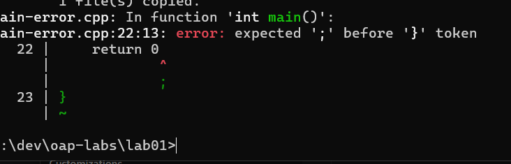

# Звіт до лабораторної роботи №1

## Налаштування середовища розробки

**Виконав:** Полуліх Маркіян  
**Група:** КІ-21  
**Варіант:** 16  
**Дата:** 11.09.2026

## Мета роботи

Мета роботи — встановити та перевірити середовища розробки Visual Studio 2022
і Visual Studio Code з компілятором g++, скомпілювати програму мовою C++ у різних середовищах та
порівняти результати для різних стандартів мови.

## Таблиця версій і параметрів

| Компонент | Версія або параметр |
|---|---|
| Операційна система | Windows 11 |
| Visual Studio | Visual Studio 2022 Community |
| Компілятор MSVC | 19.51 |
| Стандарт у Visual Studio | ISO C++17, `/std:c++17` |
| Попередження MSVC | `/W4` |
| Додаткові ключі MSVC | `/Zc:__cplusplus /utf-8` |
| Компілятор g++ | 16.1.0 (MSYS2/MinGW) |
| Стандарт у g++ | `-std=c++17` |
| Попередження g++ | `-Wall -Wextra` |
| Редактор | Visual Studio Code з розширенням C/C++ |

## Програма та компіляція

Вихідний код міститься у файлі [main.cpp](main.cpp). Він виводить дані студента,
групу, номер варіанта, назву компілятора та значення стандарту C++.

Команда для виконання в терміналі:

```text
g++ -std=c++17 -Wall -Wextra main.cpp -o main
```

Ту саму програму скомпільовано та запущено у Visual Studio, у терміналі MSYS2
і у Visual Studio Code. У всіх трьох випадках програма завершилася без помилок.

## Знімки екрана

1. Visual Studio: компіляція та запуск програми — [01-visual-studio-run.png](screenshots/01-visual-studio-run.png).
2. MSYS2/MinGW: версія g++, компіляція та запуск — [02-msys2-build.png](screenshots/02-msys2-build.png).
3. Visual Studio Code: компіляція, точка зупинки та запуск — [03-vscode-run.png](screenshots/03-vscode-run.png).

## Порівняння стандартів

### C++17

Для Visual Studio використано `/std:c++17`, для g++ — `-std=c++17`.
Очікуваний і отриманий рядок у виводі:

```text
standard 201703
```

У MSVC це значення виводиться через `_MSVC_LANG`, а в GCC — через
`__cplusplus`.

### C++98 і C++14

У g++ перевірено режим `-std=c++98`, а у Visual Studio — `/std:c++14`.
Зміна стандарту не змінює текст програми, але змінює числове значення
макросу стандарту:

| Компілятор і ключ | Значення макросу |
|---|---:|
| g++ `-std=c++98` | 199711 |
| Visual Studio `/std:c++14` | 201402 |
| g++ `-std=c++17` | 201703 |
| Visual Studio `/std:c++17` | 201703 |

Після перевірки використання стандарту повернуто до C++17.

## Перевірка помилок компіляції

Для перевірки тимчасово вилучено `;` після `return 0`.

### MSVC

Visual Studio повідомляє про синтаксичну помилку: перед закривною фігурною
дужкою пропущено крапку з комою. Наприклад:

```text
error C2143: syntax error: missing ';' before '}'
```

Знімок екрана помилки MSVC:



### g++

g++ повідомляє, що перед закривною фігурною дужкою очікується крапка з комою:

```text
error: expected ';' before '}' token
```

Знімок екрана помилки g++:



### Пояснення

Обидва компілятори виявляють ту саму помилку: оператор `return 0`
у C++ повинен завершуватися крапкою з комою. Після повернення крапки з комою
програма знову успішно компілюється у Visual Studio, у терміналі за допомогою
g++ та у Visual Studio Code.

## Висновок

Середовища Visual Studio 2022 та Visual Studio Code з компілятором g++
налаштовані. Програму перевірено у трьох середовищах: у Visual Studio
виконано компіляцію компілятором MSVC, а в терміналі MSYS2 та Visual Studio
Code — компіляцію компілятором g++. Також перевірено значення стандартів
C++98, C++14 і C++17 та порівняно повідомлення про синтаксичну помилку
від MSVC і g++.
