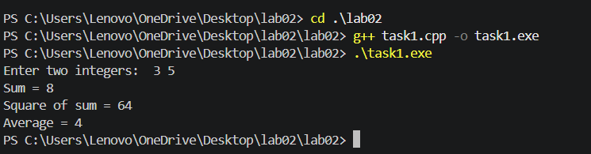
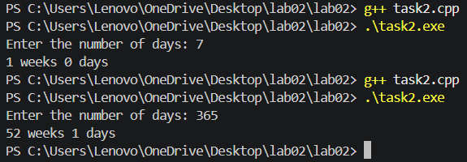

# ЛР02. Перший проєкт і репозиторій

**Студент:** Полуліх Маркіян  
**Група:** КІ-21  
**Варіант:** 16  
**Дата:** 2026-09-11  

## Частина А. Репозиторій

Репозиторій: [MarkianPolulih2009/lab02](https://github.com/MarkianPolulih2009/lab02).

У папці `lab02/` розміщено:

- `task1.cpp` — виправлена програма для пошуку помилок;
- `division-demo.cpp` — окрема навмисна демонстрація ділення на нуль;
- `task2.cpp` — програма за варіантом 16;
- `report.md` — цей звіт.

Файли `.exe`, каталоги `x64/` і тимчасові файли до репозиторію не додаються.

## Частина Б. Пошук помилок

Початковий код містив навмисні помилки. Виправлення виконувалося по одній
помилці, щоразу починаючи з першого повідомлення компілятора.

| Повідомлення або спостереження | Тип | Причина | Виправлення |
|---|---|---|---|
| `fatal error: iostream.h: No such file or directory` | Компіляції | Використано застарілий заголовок, якого немає в стандартному C++. | Замінено `#include <iostream.h>` на `#include <iostream>`. |
| `expected ';'` після оголошення `first` | Компіляції | Після `int first = 0` пропущено крапку з комою. | Додано `;`. |
| `expected ';'` після оголошення `second` | Компіляції | Після `int second = 0` пропущено крапку з комою. | Додано `;`. |
| `was not declared in this scope: secnd` | Компіляції | Помилка в імені змінної: оголошено `second`, а введення виконувалося в `secnd`. | Замінено `secnd` на `second`. |
| `was not declared in this scope: sum` | Компіляції | Ім'я C++ чутливе до регістру: оголошено `Sum`, а використано `sum`. | Назву змінної у всіх місцях уніфіковано як `sum`. |
| `undefined reference to square(int)` або `LNK2019` | Лінкування | Функцію `square` оголошено і викликано, але її визначення відсутнє. | Додано визначення `int square(int number) { return number * number; }`. |
| Для `3 5` середнє дорівнювало `4`, а не `4.0` у дійсному обчисленні | Логічна | Ділення двох `int` виконує цілочисельне ділення. | Додано `static_cast<double>(sum) / 2`. |
| `3 / 0` може завершитися аварійно або мати непередбачуваний результат | Часу виконання | Ділення цілого числа на нуль є невизначеною поведінкою. | Рядок `Ratio` вилучено з фінального `task1.cpp`; дослід винесено в `division-demo.cpp`. |

### Перевірка `task1.cpp`

Для введення `3 5` програма виводить:

```text
Sum = 8
Square of sum = 64
Average = 4
```

Для введення `3 4` програма виводить середнє `3.5`.

### Дослід ділення на нуль

У файлі `division-demo.cpp` введення `3 0` передає нуль другим операндом.
Ділення цілого числа на нуль має невизначену поведінку: програма може
завершитися аварійно, а конкретний результат не гарантується стандартом C++.
Цей файл є окремим навчальним дослідом і не входить до звичайної збірки.

## Частина В. Програма за варіантом 16

### Постановка задачі

**Вхід:** ціле невід'ємне число днів `days`.  
**Вихід:** кількість повних тижнів і кількість днів, що залишилися.  
**Обмеження:** використовуються цілі числа; умовні оператори та цикли не потрібні.

### Псевдокод

```text
початок
    ввести days
    weeks := days / 7
    remainingDays := days % 7
    вивести weeks, " weeks ", remainingDays, " days"
кінець
```

### Реалізація

Програма використовує цілочисельне ділення `days / 7` для знаходження
повних тижнів і остачу `days % 7` для знаходження днів, що залишилися.

### Тести

| Вхід | Очікуваний вихід |
|---:|---|
| `100` | `14 weeks 2 days` |
| `7` | `1 weeks 0 days` |
| `6` | `0 weeks 6 days` |
| `365` | `52 weeks 1 days` |

### Підтвердження запуску

Перевірка `task1.cpp` для введення `3 5`:



Перевірка `task2.cpp` для введення `7` і `365`:



## Історія Git

```text
96c46df ЛР1: додано повний звіт і скріншоти
f72f7be ЛР1: додано програму та звіт
e967baf ЛР2: оновлено історію в звіті
8d65fa5 ЛР2: додано скріншоти перевірки
67718b1 ЛР2: додано README та .gitignore
```
