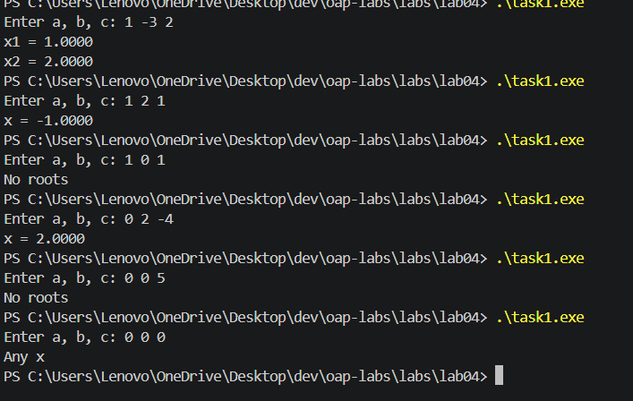
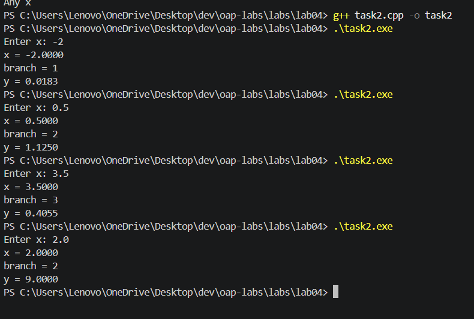
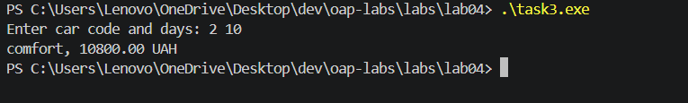
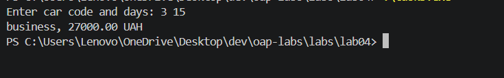
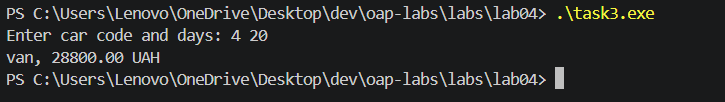

# ЛР04. Розгалуження: if/else і switch

**Студент:** Полуліх Маркіян  
**Група:** КІ-21  
**Варіант:** 16  
**Дата:** 2026-09-18

## Завдання 1. Квадратне рівняння

### Постановка задачі

Розв'язати рівняння `a*x^2 + b*x + c = 0` для дійсних `a`, `b`, `c`.

### Гілки та особливі випадки

1. `a = 0` і `b = 0`:
   - `c = 0` → будь-яке `x`;
   - `c != 0` → коренів немає.
2. `a = 0` і `b != 0` → лінійне рівняння, один корінь `x = -c / b`.
3. `D < 0` → коренів немає.
4. `D = 0` → один корінь `x = -b / (2a)`.
5. `D > 0` → два корені.

### Блок-схема

```text
початок
    ввести a, b, c
    якщо a = 0 і b = 0
        якщо c = 0
            вивести "Any x"
        інакше
            вивести "No roots"
        кінець
    інакше якщо a = 0
        x = -c / b
        вивести x
    інакше
        D = b^2 - 4ac
        якщо D < 0
            вивести "No roots"
        інакше якщо D = 0
            x = -b / (2a)
            вивести x
        інакше
            x1, x2 = ...
            вивести x1, x2
        кінець
    кінець
кінець
```

### Тести

| Вхід | Очікуваний результат | Гілка |
|---:|---|---|
| `1 -3 2` | `x1 = 1.0000, x2 = 2.0000` | два корені |
| `1 2 1` | `x = -1.0000` | один корінь |
| `1 0 1` | `No roots` | `D < 0` |
| `0 2 -4` | `x = 2.0000` | лінійне рівняння |
| `0 0 0` | `Any x` | особливий випадок |
| `0 0 5` | `No roots` | особливий випадок |

### Результати виконання

Показано перевірку основних гілок квадратного рівняння: два корені, один корінь, від'ємний дискримінант, лінійний випадок та особливі значення.



## Завдання 2. Варіант 16

### Постановка задачі

Для введеного `x` обчислити:

- `y = e^(-x^2)`, якщо `x < -1`;
- `y = x^3 + 1`, якщо `-1 <= x <= 2`;
- `y = ln(x - 2)`, якщо `x > 2`.

### Обмеження на вхід

- якщо `x` не введено — помилка вводу;
- для `x > 2` потрібне `x - 2 > 0`; інакше логарифм невизначений;
- для інших гілок функції визначені для будь-якого дійсного `x`.

### Псевдокод

```text
початок
    ввести x
    якщо не вдалося прочитати число
        вивести "Error: invalid input"
        завершити з кодом 1
    кінець

    якщо x < -1
        y = exp(-(x * x))
        branch = 1
    інакше якщо x <= 2
        y = x^3 + 1
        branch = 2
    інакше
        якщо x - 2 <= 0
            вивести "Error: x is outside the domain of ln(x - 2)"
            завершити з кодом 1
        кінець
        y = ln(x - 2)
        branch = 3
    кінець

    вивести x, branch, y
кінець
```

### Трасувальна таблиця

| x | Умова | Гілка | Значення y |
|---:|---|---:|---:|
| `-2` | `x < -1` | 1 | `e^(-4) = 0.0183` |
| `0.5` | `-1 <= x <= 2` | 2 | `0.5^3 + 1 = 1.1250` |
| `3.5` | `x > 2` | 3 | `ln(1.5) = 0.4055` |

### Приклад, де без перевірки виникла б помилка виконання

Для `x = 2` програма в гілці `x > 2` перевіряє `ln(x - 2)`. Якщо викликати логарифм без перевірки, то `x - 2 = 0`, а `ln(0)` є невизначеним (`-inf`). Це дає неприпустимий результат і може призвести до `nan` у подальших обчисленнях.

### Тести

| Вхід | Очікуваний результат | Гілка |
|---:|---|---|
| `-2` | `0.0183` | 1 |
| `0.5` | `1.1250` | 2 |
| `3.5` | `0.4055` | 3 |
| `2` | `Error: x is outside the domain of ln(x - 2)` | межа для гілки 3 |

### Результати виконання

Перевірено кілька входів і показано роботу розгалуження для трьох інтервалів значення `x`.



## Завдання 3. Короткострокова оренда авто (switch)

### Постановка задачі

Ввести код авто та кількість діб `days`.

- 1 — economy, 800 UAH/day
- 2 — comfort, 1200 UAH/day
- 3 — business, 2000 UAH/day
- 4 — van, 1600 UAH/day

Знижки на загальну суму:

- 20% при `days >= 30`;
- 10% при `days >= 7`;
- 0% інакше.

### Псевдокод

```text
початок
    ввести carCode, days
    якщо введення некоректне -> Error
    switch carCode
        case 1: price = 800; name = economy
        case 2: price = 1200; name = comfort
        case 3: price = 2000; name = business
        case 4: price = 1600; name = van
        default: Error
    кінець

    якщо days < 1 або days > 365 -> Error

    якщо days >= 30
        discount = 20%
    інакше якщо days >= 7
        discount = 10%
    інакше
        discount = 0%
    кінець

    total = price * days * (1 - discount/100)
    вивести name, total
кінець
```

### Тести

| Вхід | Очікуваний результат |
|---:|---|
| `2 10` | `comfort, 10800.00 UAH` |
| `4 35` | `van, 44800.00 UAH` |
| `5 5` | `Error` |

### Результати виконання

Показано роботу `switch` для різних кодів авто та кількості днів, включно з перевіркою знижок.







## Висновок

У лабораторній роботі використано розгалуження `if/else if/else`, логічну перевірку вхідних даних і `switch` для вибору варіанта. Було перевірено:

- особливі випадки `a = 0`, `b = 0`, `D = 0`;
- області визначення функцій у завданні 2;
- коректність `switch` для коду авто;
- перевірку помилок вводу та невірних даних.

Найважливішими моментами виявилися перевірка нульового значення для лінійного рівняння, перевірка логарифма в задачі 2 і обмеження кількості днів для задачі 3.

## Кілька завдань в одній роботі

У папці `lab04/` кожне завдання зберігається в окремому файлі з власним `main()`:

- `task1.cpp` — квадратне рівняння;
- `task2.cpp` — варіант 16;
- `task3.cpp` — оренда авто.

Компіляція окремо:

```powershell
g++ -std=c++17 -Wall -Wextra -pedantic lab04\task1.cpp -o task1.exe
.\task1.exe

g++ -std=c++17 -Wall -Wextra -pedantic lab04\task2.cpp -o task2.exe
.\task2.exe

g++ -std=c++17 -Wall -Wextra -pedantic lab04\task3.cpp -o task3.exe
.\task3.exe
```
